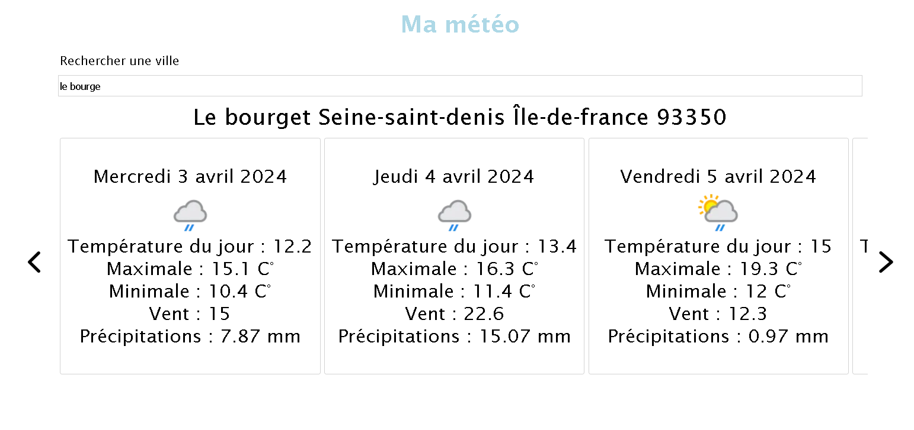

**Site permettant d'afficher la météo (nodeJS pour le backend et vanilla JS pour le frontend)**

```J'ai réalisé le carousel à la main, c'est un carousel qui déroule les images en mode infinite avec la possibilité de faire défiler les images par la droite et par la gauche au click.```

```Pour afficher les données météorologiques, j'ai récupéré les latitudes et longitudes des villes de France dans un json sur le site du gouvernement français. Le backend permet une recherche dans le document via l'autocomplétion de la barre de recherche, les données météorologiques sont récupérées et parsées dans la partie modèle du backend.```

```Le site api de récupération des données météorologiques est le suivant https://www.weatherapi.com```

*La météo est visible sur les 7 prochains jours :*

